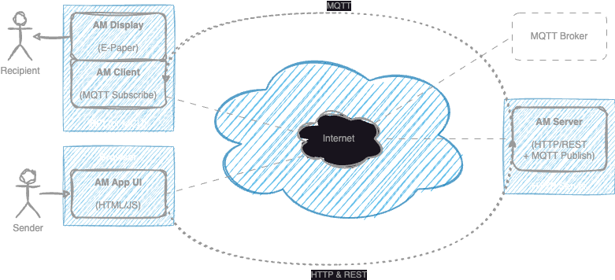

ambient-messaging
=



Installation on RPi
-
```sh
curl https://get.pimoroni.com/inky | bash
git clone https://github.com/adriencater/ambient-messaging.git
cd ambient-messaging
pip3 install -r requirements.txt
```
<!-- 
Then, run the client:
```sh
nohup AM_CLIENT_NAME=myself AM_MQTT_HOST=broker.hivemq.com python3 -m ambientmessage.client 2>&1>client.log
```
- Change `myself` with your actual nickname
- View the log: `tail -f client.log`
 -->


Quickstart
-
**1. Setup the client** on RPi + Inkyphat, run:
```sh
AM_CLIENT_NAME=myself AM_MQTT_HOST=broker.hivemq.com python3 -m ambientmessage.client
```
- Replace `myself` with your actual nickname

**2. Setup a server** on your laptop, run:
```sh
AM_MQTT_HOST=broker.hivemq.com python3 -m ambientmessage.server
```

**3. Send a message**:
- Open a browser to: http://localhost:9999/

- Or use this bash script (no need of a server) and send a message to `myself` (replace with your actual nickname)
  ```sh
  AM_MQTT_HOST=broker.hivemq.com python3 sandbox/mqtt-send.py myself "Hello World"
  ```

**4. Watch your client** for a new message !

Next, you can setup your own federative server on teh internets !


Components & Usage
-

#### Server

  - Setup your own MQTT Broker, eg. mosquitto: https://mosquitto.org, or use an existing MQTT Broker

  - Run the AM Server (HTTP & REST Service):
    ```sh
    AM_MQTT_HOST=<mqtt-broker-host> AM_MQTT_USER=<mqtt-broker-user> AM_MQTT_PASS=<mqtt-broker-pass> python3 -m ambientmessage.server
    ```

#### Client (RPi + Inkyphat)
  - Run the AM Client (MQTT Client & Inkyphat controller):
    ```sh
    AM_CLIENT_NAME=<recipient-id> AM_MQTT_HOST=<mqtt-broker-host>  AM_MQTT_USER=<mqtt-broker-user> AM_MQTT_PASS=<mqtt-broker-pass> python3 -m ambientmessage.client
    ```
    The `recipient-id` is the identifier of the recipient (eg. `damien`).

#### Application
  - Send a message via the Web App: http://server-host:9999/

  - Send a message directly via MQTT:
    ```sh
    AM_MQTT_HOST=<mqtt-broker-host> AM_MQTT_USER=<mqtt-broker-user> AM_MQTT_PASS=<mqtt-broker-pass> python3 sanbox/mqtt-send.py <recipient-id> "Hello World"
    ```
    The `recipient-id` is the identifier of the recipient (eg. `damien`).

  - 📨 Watch for messages on the Inkyphat display !

#### Core
  - Use the `core` component in the python interpreter:
    ```sh
    $ python3
    ```
    ```py
    >>> from ambientmessage import core
    >>> core.display_text('Hello\nWorld')
    ```

TODO
-
  - Use MQTT Client directly on the browser and remove the need of an *AM Server* !
    <br>https://github.com/mqttjs/MQTT.js#browser (websocket only)

  - Prevent the Wifi of the RPi to go asleep:
    ```sh
    sudo echo '
    Description=Disable wlan0 powersave
    After=network-online.target
    Wants=network-online.target

    [Service]
    Type=oneshot
    ExecStart=/sbin/iw wlan0 set power_save off

    [Install]
    WantedBy=multi-user.target' > /etc/systemd/system/wifi-always-on.service

    sudo systemctl enable /etc/systemd/system/wifi-always-on.service
    sudo reboot
    sudo iwconfig
    ```
